<div align="center">

<!-- Animated Header -->


<h3>
  
</h3>

<p>
  <a href="https://www.linkedin.com/in/vindhya-sharma-0a8a12b4/"></a>
  <a href="https://stackoverflow.com/users/8643955/vindhya-sharma"></a>
  <a href="https://www.quora.com/profile/Vindhya-Sharma"></a>
  <a href="https://youtube.com/yourchannel"></a>
</p>


</div>

<br/>


### 🚀 About This Code Craftsman

```kotlin
class VindhyaSharma : AndroidEngineer, SelfLearner, Optimist, NITian {
    
    val bio = Bio(
        name = "Vindhya Sharma",
        title = "Software Engineer Android",
        location = "Lucknow, India 🇮🇳",
        education = "National Institute of Technology (NIT) 🎓",
        mindset = "Self Learner | Optimist | Always Growing"
    )
    
    val achievements = mapOf(
        "downloads" to "1,000,000+ 🚀",
        "apps" to "Multiple successful Play Store apps 📱",
        "impact" to "Touching millions of lives daily ❤️",
        "expertise" to "Android | Kotlin | Java"
    )
    
    val philosophy = """
        🌱 Learning never stops
        ☀️ Optimism fuels innovation
        💻 Code with passion, build with purpose
        🎯 Every problem has a solution
    """.trimIndent()
    
    fun sayHi() = """
        Hey there! 👋
        
        I'm a NITian who believes in the power of continuous learning 📚
        With an optimistic mindset, I turn complex problems into 
        elegant solutions that millions of users love! 
        
        Let's build something amazing together! ✨
    """.trimIndent()
}
```

<br clear="right"/>

---

<div align="center">

## 🎯 My Mission

<table>
<tr>
<td align="center" width="33%">

<br/><b>🎓 NITian Background</b>
<br/>Strong foundation in engineering excellence
</td>
<td align="center" width="33%">

<br/><b>📚 Self Learner</b>
<br/>Constantly evolving, always curious
</td>
<td align="center" width="33%">

<br/><b>☀️ Optimist</b>
<br/>Every challenge is an opportunity
</td>
</tr>
</table>

</div>

---

## 🛠️ Arsenal of Technologies

<div align="center">

<table>
<tr>
<td valign="top" width="33%">

### 📱 Mobile Mastery
<div align="center">  

<br/><br/>


</div>

</td>
<td valign="top" width="33%">

### 🔧 Backend Power
<div align="center">  

<br/><br/>


</div>

</td>
<td valign="top" width="33%">

### ☁️ Cloud & Tools
<div align="center">  

<br/><br/>


</div>

</td>
</tr>
</table>

</div>

---

## 🎨 Featured Masterpieces

<div align="center">

### 🌟 Projects That Make a Difference

</div>

<table>
<tr>
<td width="50%" valign="top">

<div align="center">

### 🔰 SmartCalc - Kotlin
[](https://github.com/vindhyasharma14/smartcalc-kotlin)
[](https://github.com/vindhyasharma14/smartcalc-kotlin/stargazers)


</div>

**Your Gateway to Kotlin Mastery!** 🚀

An interactive learning companion that transforms complex Kotlin concepts into digestible, hands-on examples.

**✨ What Makes It Special:**
- 📝 Live operator demonstrations
- 🎯 Variable concept visualizations
- 💡 Interactive code playground
- 🎓 Beginner to advanced progression
- 🔥 Real-world use cases

**🛠️ Tech Stack:**
```
Kotlin • Android SDK • Material 3
MVVM • LiveData • View Binding
```

**🎯 Perfect For:**
- Students learning Kotlin
- Android developers upskilling
- Code bootcamp participants

<div align="center">

[](https://github.com/vindhyasharma14/smartcalc-kotlin)
[](#)

</div>

</td>
<td width="50%" valign="top">

<div align="center">

### 🚀 Coming Soon: Next-Gen Apps


</div>

**🔮 What's Brewing in the Lab:**

**📱 Jetpack Compose Showcase**
- Modern UI with Compose
- Material You theming
- Smooth animations

**🎮 Gaming App**
- High-performance graphics
- Real-time multiplayer
- Cloud synchronization

**🤖 AI-Powered Assistant**
- Machine learning integration
- Natural language processing
- Smart recommendations

**💼 Enterprise Solution**
- Offline-first architecture
- Advanced security features
- Scalable backend

<div align="center">

**⭐ Star my repos to get notified!**

[](https://github.com/YOUR_GITHUB_USERNAME)

</div>

</td>
</tr>
</table>

---

<div align="center">

## 📊 GitHub Stats That Tell a Story

<!-- Replace 'YOUR_GITHUB_USERNAME' with your actual GitHub username -->


### 🏆 Trophy Cabinet


</div>

---

## 💭 Developer Philosophy

<div align="center">

<table>
<tr>
<td width="50%">

### 🎯 Code Principles

```kotlin
val principles = listOf(
    "Write code for humans, not machines",
    "Test early, test often, test always",
    "Simple solutions beat clever ones",
    "Comments explain why, not what",
    "Refactor ruthlessly, commit fearlessly"
)
```

</td>
<td width="50%">

### 🌱 Growth Mindset

```kotlin
fun continuousLearning() {
    while (developer.isAlive()) {
        learn()
        build()
        share()
        repeat()
    }
}
```

</td>
</tr>
</table>

</div>

---

## 🎯 Current Focus & Goals

```mermaid
graph LR
    A[📚 Learning] -->|Jetpack Compose| B[🚀 Building]
    B -->|Modern Apps| C[📱 Publishing]
    C -->|User Feedback| D[🔄 Iterating]
    D -->|Improvements| A
    
    style A fill:#F85D7F,stroke:#fff,stroke-width:2px,color:#fff
    style B fill:#F8D866,stroke:#fff,stroke-width:2px,color:#000
    style C fill:#4CAF50,stroke:#fff,stroke-width:2px,color:#fff
    style D fill:#2196F3,stroke:#fff,stroke-width:2px,color:#fff
```

<div align="center">



</div>

<table>
<tr>
<td width="33%" align="center">

### 🎓 Currently Learning


</td>
<td width="33%" align="center">

### 🔨 Currently Building


</td>
<td width="33%" align="center">

### 🎯 2025 Goals
✅ Master Jetpack Compose<br/>
✅ Contribute to major OSS<br/>
✅ Launch 2 new apps<br/>
✅ Share 50+ dev tips

</td>
</tr>
</table>

---

## 🌟 Why Choose to Collaborate With Me?

<div align="center">

<table>
<tr>
<td align="center" width="25%">

<br/><b>🎨 Design Savvy</b>
<br/>I don't just code, I craft experiences that users love
</td>
<td align="center" width="25%">

<br/><b>⚡ Performance Focused</b>
<br/>Every millisecond counts, every byte matters
</td>
<td align="center" width="25%">

<br/><b>🧹 Clean Coder</b>
<br/>Maintainable, testable, and scalable code
</td>
<td align="center" width="25%">

<br/><b>🤝 Team Player</b>
<br/>Communication, collaboration, and continuous improvement
</td>
</tr>
</table>

</div>

---

## 🎪 Fun Facts About Me


- 🎓 **Proud NITian** - Engineering excellence runs in my veins
- 🎯 **Helped 1M+ users** make their lives easier through my apps
- 📚 **Self-taught master** - If it can be learned, I'll master it
- ☀️ **Eternal optimist** - Every bug is just a feature in disguise
- ☕ **Coffee enthusiast** - Code quality directly proportional to coffee intake
- 🎮 **Gaming fanatic** - Designing games taught me UX excellence
- 💡 **Knowledge sharer** - Active on Stack Overflow helping fellow developers
- 🚀 **Always shipping** - If it's not in production, it doesn't count
- 🎨 **Design geek** - Pixel-perfect is not perfectionism, it's professionalism
- 🌙 **Night owl** - Best code written after midnight (don't judge!)

<br clear="right"/>

---

## 📬 Let's Build Something Amazing Together!

<div align="center">

 <br/>

### 💼 Open for:

<table>
<tr>
<td align="center">💻<br/><b>Freelance Projects</b></td>
<td align="center">🤝<br/><b>Collaboration</b></td>
<td align="center">👔<br/><b>Full-time Roles</b></td>
<td align="center">🎓<br/><b>Mentorship</b></td>
</tr>
</table>

<br/>

### 📫 Reach Me At:

<a href="https://www.linkedin.com/in/vindhya-sharma-0a8a12b4/"></a>
<a href="mailto:your.email@example.com"></a>
<a href="https://stackoverflow.com/users/8643955/vindhya-sharma"></a>

<br/><br/>

### ⚡ Quick Response Promise
```kotlin
when (yourMessage) {
    is Interesting -> respondWithin("24 hours")
    is Urgent -> respondWithin("6 hours")
    is Collaboration -> respondWithin("12 hours")
    else -> respondWithin("48 hours")
}
```

</div>

---

<div align="center">

## 💙 Support My Work

If you find my projects helpful, consider:

⭐ **Starring** my repositories<br/>
👀 **Following** me on GitHub<br/>
🔄 **Sharing** my projects<br/>
💬 **Contributing** to discussions<br/>

<br/>

### 🎵 Currently Listening To While Coding

[](https://open.spotify.com/user/yourspotifyusername)

<br/>

**Remember:** *Great software isn't built in a day, but every day spent coding is a step toward greatness!* 💫

---


**✨ Thanks for stopping by! May your builds be green and your bugs be few! 🐛🚫**


</div>
